# Kiến trúc Cơ sở Dữ liệu - Coffee Shop Management System

## Tổng quan

Hệ thống quản lý quán café cần một cơ sở dữ liệu quan hệ (RDBMS) để quản lý các nghiệp vụ phức tạp bao gồm: bán hàng, kho, nhân viên, tài chính, và báo cáo. Đề xuất sử dụng **PostgreSQL** hoặc **MySQL** cho production.

---

## Sơ đồ ERD (Entity Relationship Diagram)

```mermaid
erDiagram
    %% Core Entities
    USERS ||--o{ STAFF : "manages"
    USERS ||--o{ ROLES : "has"
    ROLES ||--o{ ROLE_PERMISSIONS : "contains"
    PERMISSIONS ||--o{ ROLE_PERMISSIONS : "assigned_to"
    
    %% Products & Inventory
    CATEGORIES ||--o{ PRODUCTS : "contains"
    PRODUCTS ||--o{ PRODUCT_INGREDIENTS : "requires"
    INGREDIENTS ||--o{ PRODUCT_INGREDIENTS : "used_in"
    INGREDIENTS ||--o{ INVENTORY_BATCHES : "tracked_by"
    SUPPLIERS ||--o{ INVENTORY_BATCHES : "supplies"
    
    %% Sales & Orders
    CUSTOMERS ||--o{ ORDERS : "places"
    CUSTOMER_GROUPS ||--o{ CUSTOMERS : "categorizes"
    ORDERS ||--o{ ORDER_ITEMS : "contains"
    PRODUCTS ||--o{ ORDER_ITEMS : "sold_as"
    TABLES ||--o{ ORDERS : "serves"
    STAFF ||--o{ ORDERS : "processes"
    
    %% Promotions & Combos
    PROMOTIONS ||--o{ ORDER_ITEMS : "applies_to"
    COMBOS ||--o{ COMBO_ITEMS : "includes"
    PRODUCTS ||--o{ COMBO_ITEMS : "part_of"
    
    %% Purchasing
    SUPPLIERS ||--o{ PURCHASE_ORDERS : "receives_from"
    PURCHASE_ORDERS ||--o{ PURCHASE_ORDER_ITEMS : "contains"
    INGREDIENTS ||--o{ PURCHASE_ORDER_ITEMS : "ordered_as"
    STAFF ||--o{ PURCHASE_ORDERS : "creates"
    
    %% Finance
    FINANCE_TRANSACTIONS ||--o{ FINANCE_CATEGORIES : "categorized_by"
    STAFF ||--o{ FINANCE_TRANSACTIONS : "records"
    BANK_ACCOUNTS ||--o{ FINANCE_TRANSACTIONS : "processes"
    
    %% Staff Management
    STAFF ||--o{ SHIFTS : "assigned_to"
    STAFF ||--o{ TIMEKEEPING : "clocks"
    STAFF ||--o{ PAYROLL : "receives"
    PAYROLL ||--o{ PAYSLIPS : "generates"
    
    %% Stock Management
    INGREDIENTS ||--o{ STOCK_CHECKS : "verified_by"
    INGREDIENTS ||--o{ WRITE_OFFS : "disposed_in"
    STAFF ||--o{ STOCK_CHECKS : "performs"
    STAFF ||--o{ WRITE_OFFS : "approves"
```



---

## Chi tiết các bảng (Tables)

### 1. Quản lý Người dùng & Phân quyền

#### 1.1 `users` - Tài khoản người dùng
```sql
CREATE TABLE users (
    id UUID PRIMARY KEY DEFAULT gen_random_uuid(),
    username VARCHAR(50) UNIQUE NOT NULL,
    password_hash VARCHAR(255) NOT NULL,
    full_name VARCHAR(100) NOT NULL,
    role_id UUID REFERENCES roles(id),
    status VARCHAR(20) DEFAULT 'active' CHECK (status IN ('active', 'inactive')),
    custom_permissions JSONB, -- Override role permissions
    created_at TIMESTAMP DEFAULT CURRENT_TIMESTAMP,
    updated_at TIMESTAMP DEFAULT CURRENT_TIMESTAMP,
    last_login TIMESTAMP,
    
    INDEX idx_username (username),
    INDEX idx_role_id (role_id),
    INDEX idx_status (status)
);
```

#### 1.2 `roles` - Vai trò
```sql
CREATE TABLE roles (
    id UUID PRIMARY KEY DEFAULT gen_random_uuid(),
    name VARCHAR(50) UNIQUE NOT NULL,
    description TEXT,
    is_system BOOLEAN DEFAULT false, -- Cannot delete system roles
    created_at TIMESTAMP DEFAULT CURRENT_TIMESTAMP,
    updated_at TIMESTAMP DEFAULT CURRENT_TIMESTAMP,
    
    INDEX idx_name (name)
);
```

#### 1.3 `permissions` - Quyền hạn
```sql
CREATE TABLE permissions (
    id VARCHAR(100) PRIMARY KEY, -- e.g., 'goods_inventory:view'
    name VARCHAR(100) NOT NULL,
    category VARCHAR(50) NOT NULL, -- e.g., 'goods', 'finance', 'staff'
    description TEXT,
    created_at TIMESTAMP DEFAULT CURRENT_TIMESTAMP
);
```

#### 1.4 `role_permissions` - Quyền của vai trò
```sql
CREATE TABLE role_permissions (
    role_id UUID REFERENCES roles(id) ON DELETE CASCADE,
    permission_id VARCHAR(100) REFERENCES permissions(id) ON DELETE CASCADE,
    PRIMARY KEY (role_id, permission_id),
    
    INDEX idx_role_id (role_id),
    INDEX idx_permission_id (permission_id)
);
```

---

### 2. Quản lý Sản phẩm & Kho

#### 2.1 `categories` - Danh mục
```sql
CREATE TABLE categories (
    id UUID PRIMARY KEY DEFAULT gen_random_uuid(),
    name VARCHAR(100) NOT NULL,
    type VARCHAR(20) CHECK (type IN ('product', 'ingredient')),
    description TEXT,
    display_order INT DEFAULT 0,
    created_at TIMESTAMP DEFAULT CURRENT_TIMESTAMP,
    updated_at TIMESTAMP DEFAULT CURRENT_TIMESTAMP,
    
    INDEX idx_type (type),
    INDEX idx_display_order (display_order)
);
```

#### 2.2 `products` - Sản phẩm (Menu)
```sql
CREATE TABLE products (
    id UUID PRIMARY KEY DEFAULT gen_random_uuid(),
    name VARCHAR(100) NOT NULL,
    category_id UUID REFERENCES categories(id),
    description TEXT,
    image_url VARCHAR(500),
    base_price DECIMAL(12, 2) NOT NULL,
    selling_price DECIMAL(12, 2) NOT NULL,
    cost_price DECIMAL(12, 2), -- Calculated from ingredients
    status VARCHAR(20) DEFAULT 'selling' CHECK (status IN ('selling', 'paused', 'not_running', 'hot')),
    is_topping BOOLEAN DEFAULT false,
    preparation_time INT, -- in minutes
    created_at TIMESTAMP DEFAULT CURRENT_TIMESTAMP,
    updated_at TIMESTAMP DEFAULT CURRENT_TIMESTAMP,
    
    INDEX idx_category_id (category_id),
    INDEX idx_status (status),
    INDEX idx_is_topping (is_topping)
);
```

#### 2.3 `ingredients` - Nguyên liệu
```sql
CREATE TABLE ingredients (
    id UUID PRIMARY KEY DEFAULT gen_random_uuid(),
    name VARCHAR(100) NOT NULL,
    category_id UUID REFERENCES categories(id),
    unit VARCHAR(20) NOT NULL, -- kg, lít, gram, etc.
    current_stock DECIMAL(12, 3) DEFAULT 0,
    min_stock DECIMAL(12, 3) DEFAULT 0,
    max_stock DECIMAL(12, 3),
    avg_unit_cost DECIMAL(12, 2), -- Weighted average
    total_value DECIMAL(15, 2), -- current_stock * avg_unit_cost
    status VARCHAR(20) CHECK (status IN ('good', 'low', 'critical', 'expiring', 'expired')),
    image_url VARCHAR(500),
    created_at TIMESTAMP DEFAULT CURRENT_TIMESTAMP,
    updated_at TIMESTAMP DEFAULT CURRENT_TIMESTAMP,
    
    INDEX idx_category_id (category_id),
    INDEX idx_status (status),
    INDEX idx_current_stock (current_stock)
);
```

#### 2.4 `product_ingredients` - Công thức sản phẩm
```sql
CREATE TABLE product_ingredients (
    id UUID PRIMARY KEY DEFAULT gen_random_uuid(),
    product_id UUID REFERENCES products(id) ON DELETE CASCADE,
    ingredient_id UUID REFERENCES ingredients(id),
    quantity DECIMAL(12, 3) NOT NULL, -- Amount needed per product unit
    unit VARCHAR(20) NOT NULL,
    
    UNIQUE (product_id, ingredient_id),
    INDEX idx_product_id (product_id),
    INDEX idx_ingredient_id (ingredient_id)
);
```

#### 2.5 `inventory_batches` - Lô hàng tồn kho
```sql
CREATE TABLE inventory_batches (
    id UUID PRIMARY KEY DEFAULT gen_random_uuid(),
    ingredient_id UUID REFERENCES ingredients(id) ON DELETE CASCADE,
    batch_code VARCHAR(50) NOT NULL,
    supplier_id UUID REFERENCES suppliers(id),
    quantity DECIMAL(12, 3) NOT NULL,
    remaining_quantity DECIMAL(12, 3) NOT NULL,
    unit VARCHAR(20) NOT NULL,
    unit_cost DECIMAL(12, 2) NOT NULL,
    entry_date TIMESTAMP DEFAULT CURRENT_TIMESTAMP,
    expiry_date DATE,
    purchase_order_id UUID REFERENCES purchase_orders(id),
    
    INDEX idx_ingredient_id (ingredient_id),
    INDEX idx_batch_code (batch_code),
    INDEX idx_expiry_date (expiry_date),
    INDEX idx_supplier_id (supplier_id)
);
```

---

### 3. Quản lý Khách hàng

#### 3.1 `customer_groups` - Nhóm khách hàng
```sql
CREATE TABLE customer_groups (
    id UUID PRIMARY KEY DEFAULT gen_random_uuid(),
    name VARCHAR(100) NOT NULL,
    description TEXT,
    discount_percent DECIMAL(5, 2) DEFAULT 0,
    min_points INT DEFAULT 0, -- Minimum points to qualify
    created_at TIMESTAMP DEFAULT CURRENT_TIMESTAMP,
    updated_at TIMESTAMP DEFAULT CURRENT_TIMESTAMP,
    
    INDEX idx_name (name)
);
```

#### 3.2 `customers` - Khách hàng
```sql
CREATE TABLE customers (
    id UUID PRIMARY KEY DEFAULT gen_random_uuid(),
    code VARCHAR(20) UNIQUE NOT NULL, -- Auto-generated: KH001, KH002
    name VARCHAR(100) NOT NULL,
    gender VARCHAR(10) CHECK (gender IN ('male', 'female', 'other')),
    birthday DATE,
    phone VARCHAR(20),
    email VARCHAR(100),
    address TEXT,
    city VARCHAR(50),
    group_id UUID REFERENCES customer_groups(id),
    loyalty_points INT DEFAULT 0,
    total_orders INT DEFAULT 0,
    total_spent DECIMAL(15, 2) DEFAULT 0,
    status VARCHAR(20) DEFAULT 'active' CHECK (status IN ('active', 'inactive')),
    created_at TIMESTAMP DEFAULT CURRENT_TIMESTAMP,
    updated_at TIMESTAMP DEFAULT CURRENT_TIMESTAMP,
    
    INDEX idx_code (code),
    INDEX idx_phone (phone),
    INDEX idx_email (email),
    INDEX idx_group_id (group_id),
    INDEX idx_status (status)
);
```

---

### 4. Quản lý Bán hàng

#### 4.1 `tables` - Bàn
```sql
CREATE TABLE tables (
    id UUID PRIMARY KEY DEFAULT gen_random_uuid(),
    table_number INT NOT NULL,
    area VARCHAR(50) NOT NULL, -- 'Tầng 1', 'Tầng 2', 'Sân vườn'
    capacity INT NOT NULL,
    status VARCHAR(20) DEFAULT 'available' CHECK (status IN ('available', 'occupied', 'reserved')),
    current_order_id UUID REFERENCES orders(id),
    created_at TIMESTAMP DEFAULT CURRENT_TIMESTAMP,
    updated_at TIMESTAMP DEFAULT CURRENT_TIMESTAMP,
    
    UNIQUE (table_number, area),
    INDEX idx_status (status),
    INDEX idx_area (area)
);
```

#### 4.2 `orders` - Đơn hàng
```sql
CREATE TABLE orders (
    id UUID PRIMARY KEY DEFAULT gen_random_uuid(),
    order_code VARCHAR(20) UNIQUE NOT NULL, -- HD001, HD002
    order_type VARCHAR(20) CHECK (order_type IN ('dine_in', 'takeaway')),
    table_id UUID REFERENCES tables(id),
    customer_id UUID REFERENCES customers(id),
    staff_id UUID REFERENCES staff(id),
    status VARCHAR(20) DEFAULT 'pending' CHECK (status IN ('pending', 'preparing', 'completed', 'paid', 'cancelled')),
    subtotal DECIMAL(15, 2) NOT NULL,
    discount_amount DECIMAL(15, 2) DEFAULT 0,
    tax_amount DECIMAL(15, 2) DEFAULT 0,
    total_amount DECIMAL(15, 2) NOT NULL,
    payment_method VARCHAR(20) CHECK (payment_method IN ('cash', 'card', 'transfer', 'mixed')),
    payment_status VARCHAR(20) DEFAULT 'unpaid' CHECK (payment_status IN ('unpaid', 'partial', 'paid')),
    paid_amount DECIMAL(15, 2) DEFAULT 0,
    notes TEXT,
    created_at TIMESTAMP DEFAULT CURRENT_TIMESTAMP,
    completed_at TIMESTAMP,
    updated_at TIMESTAMP DEFAULT CURRENT_TIMESTAMP,
    
    INDEX idx_order_code (order_code),
    INDEX idx_table_id (table_id),
    INDEX idx_customer_id (customer_id),
    INDEX idx_staff_id (staff_id),
    INDEX idx_status (status),
    INDEX idx_created_at (created_at)
);
```

#### 4.3 `order_items` - Chi tiết đơn hàng
```sql
CREATE TABLE order_items (
    id UUID PRIMARY KEY DEFAULT gen_random_uuid(),
    order_id UUID REFERENCES orders(id) ON DELETE CASCADE,
    product_id UUID REFERENCES products(id),
    combo_id UUID REFERENCES combos(id),
    name VARCHAR(100) NOT NULL, -- Snapshot of product name
    quantity INT NOT NULL,
    unit_price DECIMAL(12, 2) NOT NULL,
    discount_amount DECIMAL(12, 2) DEFAULT 0,
    total_price DECIMAL(15, 2) NOT NULL,
    status VARCHAR(20) DEFAULT 'pending' CHECK (status IN ('pending', 'preparing', 'completed', 'served', 'cancelled', 'out-of-stock')),
    customization JSONB, -- Size, sugar level, ice level, toppings
    notes TEXT,
    is_topping BOOLEAN DEFAULT false,
    parent_item_id UUID REFERENCES order_items(id), -- For toppings
    created_at TIMESTAMP DEFAULT CURRENT_TIMESTAMP,
    updated_at TIMESTAMP DEFAULT CURRENT_TIMESTAMP,
    
    INDEX idx_order_id (order_id),
    INDEX idx_product_id (product_id),
    INDEX idx_combo_id (combo_id),
    INDEX idx_status (status)
);
```

---

### 5. Khuyến mãi & Combo

#### 5.1 `promotions` - Khuyến mãi
```sql
CREATE TABLE promotions (
    id UUID PRIMARY KEY DEFAULT gen_random_uuid(),
    name VARCHAR(100) NOT NULL,
    description TEXT,
    type VARCHAR(20) CHECK (type IN ('percentage', 'fixed_amount', 'buy_x_get_y', 'combo')),
    discount_value DECIMAL(12, 2), -- Percentage or fixed amount
    min_order_value DECIMAL(15, 2),
    max_discount DECIMAL(15, 2),
    applicable_to VARCHAR(20) CHECK (applicable_to IN ('all', 'category', 'product', 'customer_group')),
    applicable_ids JSONB, -- Array of category/product/customer_group IDs
    start_date TIMESTAMP NOT NULL,
    end_date TIMESTAMP NOT NULL,
    is_active BOOLEAN DEFAULT true,
    usage_limit INT, -- Max number of uses
    usage_count INT DEFAULT 0,
    created_at TIMESTAMP DEFAULT CURRENT_TIMESTAMP,
    updated_at TIMESTAMP DEFAULT CURRENT_TIMESTAMP,
    
    INDEX idx_type (type),
    INDEX idx_is_active (is_active),
    INDEX idx_start_date (start_date),
    INDEX idx_end_date (end_date)
);
```

#### 5.2 `combos` - Combo sản phẩm
```sql
CREATE TABLE combos (
    id UUID PRIMARY KEY DEFAULT gen_random_uuid(),
    name VARCHAR(100) NOT NULL,
    description TEXT,
    image_url VARCHAR(500),
    original_price DECIMAL(12, 2) NOT NULL,
    combo_price DECIMAL(12, 2) NOT NULL,
    savings DECIMAL(12, 2) NOT NULL,
    is_active BOOLEAN DEFAULT true,
    start_date TIMESTAMP,
    end_date TIMESTAMP,
    created_at TIMESTAMP DEFAULT CURRENT_TIMESTAMP,
    updated_at TIMESTAMP DEFAULT CURRENT_TIMESTAMP,
    
    INDEX idx_is_active (is_active)
);
```

#### 5.3 `combo_items` - Sản phẩm trong combo
```sql
CREATE TABLE combo_items (
    id UUID PRIMARY KEY DEFAULT gen_random_uuid(),
    combo_id UUID REFERENCES combos(id) ON DELETE CASCADE,
    product_id UUID REFERENCES products(id),
    quantity INT NOT NULL DEFAULT 1,
    group_name VARCHAR(50), -- For flexible combos: 'Đồ uống', 'Bánh ngọt'
    is_required BOOLEAN DEFAULT true,
    
    INDEX idx_combo_id (combo_id),
    INDEX idx_product_id (product_id)
);
```

---

### 6. Nhà cung cấp & Mua hàng

#### 6.1 `suppliers` - Nhà cung cấp
```sql
CREATE TABLE suppliers (
    id UUID PRIMARY KEY DEFAULT gen_random_uuid(),
    code VARCHAR(20) UNIQUE NOT NULL, -- NCC001, NCC002
    name VARCHAR(100) NOT NULL,
    contact_person VARCHAR(100),
    phone VARCHAR(20),
    email VARCHAR(100),
    address TEXT,
    tax_code VARCHAR(50),
    category VARCHAR(50), -- 'Cà phê', 'Sữa', 'Bánh', etc.
    total_purchases DECIMAL(15, 2) DEFAULT 0,
    total_debt DECIMAL(15, 2) DEFAULT 0,
    status VARCHAR(20) DEFAULT 'active' CHECK (status IN ('active', 'inactive')),
    notes TEXT,
    created_at TIMESTAMP DEFAULT CURRENT_TIMESTAMP,
    updated_at TIMESTAMP DEFAULT CURRENT_TIMESTAMP,
    
    INDEX idx_code (code),
    INDEX idx_name (name),
    INDEX idx_status (status)
);
```

#### 6.2 `purchase_orders` - Đơn mua hàng
```sql
CREATE TABLE purchase_orders (
    id UUID PRIMARY KEY DEFAULT gen_random_uuid(),
    code VARCHAR(20) UNIQUE NOT NULL, -- PN001, PN002
    supplier_id UUID REFERENCES suppliers(id),
    staff_id UUID REFERENCES staff(id),
    order_date TIMESTAMP DEFAULT CURRENT_TIMESTAMP,
    expected_delivery DATE,
    actual_delivery DATE,
    status VARCHAR(20) DEFAULT 'draft' CHECK (status IN ('draft', 'confirmed', 'completed', 'cancelled')),
    subtotal DECIMAL(15, 2) NOT NULL,
    discount_amount DECIMAL(15, 2) DEFAULT 0,
    tax_amount DECIMAL(15, 2) DEFAULT 0,
    total_amount DECIMAL(15, 2) NOT NULL,
    paid_amount DECIMAL(15, 2) DEFAULT 0,
    debt_amount DECIMAL(15, 2) DEFAULT 0,
    payment_status VARCHAR(20) DEFAULT 'unpaid' CHECK (payment_status IN ('unpaid', 'partial', 'paid')),
    notes TEXT,
    created_at TIMESTAMP DEFAULT CURRENT_TIMESTAMP,
    updated_at TIMESTAMP DEFAULT CURRENT_TIMESTAMP,
    
    INDEX idx_code (code),
    INDEX idx_supplier_id (supplier_id),
    INDEX idx_staff_id (staff_id),
    INDEX idx_status (status),
    INDEX idx_order_date (order_date)
);
```

#### 6.3 `purchase_order_items` - Chi tiết đơn mua hàng
```sql
CREATE TABLE purchase_order_items (
    id UUID PRIMARY KEY DEFAULT gen_random_uuid(),
    purchase_order_id UUID REFERENCES purchase_orders(id) ON DELETE CASCADE,
    ingredient_id UUID REFERENCES ingredients(id),
    batch_code VARCHAR(50),
    quantity DECIMAL(12, 3) NOT NULL,
    unit VARCHAR(20) NOT NULL,
    unit_price DECIMAL(12, 2) NOT NULL,
    discount_percent DECIMAL(5, 2) DEFAULT 0,
    discount_amount DECIMAL(12, 2) DEFAULT 0,
    total_price DECIMAL(15, 2) NOT NULL,
    expiry_date DATE,
    
    INDEX idx_purchase_order_id (purchase_order_id),
    INDEX idx_ingredient_id (ingredient_id)
);
```

#### 6.4 `purchase_payments` - Thanh toán mua hàng
```sql
CREATE TABLE purchase_payments (
    id UUID PRIMARY KEY DEFAULT gen_random_uuid(),
    purchase_order_id UUID REFERENCES purchase_orders(id) ON DELETE CASCADE,
    payment_date TIMESTAMP DEFAULT CURRENT_TIMESTAMP,
    amount DECIMAL(15, 2) NOT NULL,
    payment_method VARCHAR(20) CHECK (payment_method IN ('cash', 'transfer', 'card')),
    bank_account_id UUID REFERENCES bank_accounts(id),
    notes TEXT,
    created_by UUID REFERENCES staff(id),
    
    INDEX idx_purchase_order_id (purchase_order_id),
    INDEX idx_payment_date (payment_date)
);
```

---

### 7. Nhân viên & Lương

#### 7.1 `staff` - Nhân viên
```sql
CREATE TABLE staff (
    id UUID PRIMARY KEY DEFAULT gen_random_uuid(),
    code VARCHAR(20) UNIQUE NOT NULL, -- NV001, NV002
    full_name VARCHAR(100) NOT NULL,
    gender VARCHAR(10) CHECK (gender IN ('male', 'female', 'other')),
    birthday DATE,
    phone VARCHAR(20),
    email VARCHAR(100),
    address TEXT,
    city VARCHAR(50),
    id_card VARCHAR(20),
    position VARCHAR(50), -- 'Quản lý', 'Pha chế', 'Thu ngân', 'Phục vụ'
    department VARCHAR(50),
    hire_date DATE NOT NULL,
    status VARCHAR(20) DEFAULT 'active' CHECK (status IN ('active', 'inactive', 'on_leave')),
    user_id UUID REFERENCES users(id), -- Link to login account
    avatar_url VARCHAR(500),
    created_at TIMESTAMP DEFAULT CURRENT_TIMESTAMP,
    updated_at TIMESTAMP DEFAULT CURRENT_TIMESTAMP,
    
    INDEX idx_code (code),
    INDEX idx_position (position),
    INDEX idx_status (status),
    INDEX idx_user_id (user_id)
);
```

#### 7.2 `staff_salary_settings` - Thiết lập lương
```sql
CREATE TABLE staff_salary_settings (
    id UUID PRIMARY KEY DEFAULT gen_random_uuid(),
    staff_id UUID REFERENCES staff(id) ON DELETE CASCADE,
    salary_type VARCHAR(20) CHECK (salary_type IN ('hourly', 'daily', 'monthly')),
    base_rate DECIMAL(15, 2) NOT NULL, -- Hourly/daily/monthly rate
    overtime_rate DECIMAL(15, 2),
    allowances JSONB, -- {"transport": 500000, "meal": 300000}
    effective_from DATE NOT NULL,
    effective_to DATE,
    
    INDEX idx_staff_id (staff_id),
    INDEX idx_effective_from (effective_from)
);
```

#### 7.3 `shifts` - Ca làm việc
```sql
CREATE TABLE shifts (
    id UUID PRIMARY KEY DEFAULT gen_random_uuid(),
    name VARCHAR(50) NOT NULL, -- 'Ca sáng', 'Ca chiều', 'Ca tối'
    start_time TIME NOT NULL,
    end_time TIME NOT NULL,
    is_active BOOLEAN DEFAULT true,
    
    INDEX idx_name (name)
);
```

#### 7.4 `staff_schedules` - Lịch làm việc
```sql
CREATE TABLE staff_schedules (
    id UUID PRIMARY KEY DEFAULT gen_random_uuid(),
    staff_id UUID REFERENCES staff(id) ON DELETE CASCADE,
    shift_id UUID REFERENCES shifts(id),
    work_date DATE NOT NULL,
    status VARCHAR(20) DEFAULT 'scheduled' CHECK (status IN ('scheduled', 'completed', 'cancelled', 'swapped')),
    notes TEXT,
    created_at TIMESTAMP DEFAULT CURRENT_TIMESTAMP,
    updated_at TIMESTAMP DEFAULT CURRENT_TIMESTAMP,
    
    UNIQUE (staff_id, work_date, shift_id),
    INDEX idx_staff_id (staff_id),
    INDEX idx_work_date (work_date),
    INDEX idx_shift_id (shift_id)
);
```

#### 7.5 `timekeeping` - Chấm công
```sql
CREATE TABLE timekeeping (
    id UUID PRIMARY KEY DEFAULT gen_random_uuid(),
    staff_id UUID REFERENCES staff(id) ON DELETE CASCADE,
    schedule_id UUID REFERENCES staff_schedules(id),
    work_date DATE NOT NULL,
    shift_id UUID REFERENCES shifts(id),
    clock_in TIMESTAMP,
    clock_out TIMESTAMP,
    total_hours DECIMAL(5, 2), -- Calculated
    overtime_hours DECIMAL(5, 2) DEFAULT 0,
    status VARCHAR(20) CHECK (status IN ('present', 'absent', 'late', 'early_leave', 'overtime')),
    notes TEXT,
    
    INDEX idx_staff_id (staff_id),
    INDEX idx_work_date (work_date),
    INDEX idx_schedule_id (schedule_id)
);
```

#### 7.6 `payroll` - Bảng lương
```sql
CREATE TABLE payroll (
    id UUID PRIMARY KEY DEFAULT gen_random_uuid(),
    code VARCHAR(20) UNIQUE NOT NULL, -- BL202401
    period_start DATE NOT NULL,
    period_end DATE NOT NULL,
    status VARCHAR(20) DEFAULT 'draft' CHECK (status IN ('draft', 'finalized', 'paid')),
    total_amount DECIMAL(15, 2) NOT NULL,
    created_by UUID REFERENCES staff(id),
    finalized_at TIMESTAMP,
    created_at TIMESTAMP DEFAULT CURRENT_TIMESTAMP,
    updated_at TIMESTAMP DEFAULT CURRENT_TIMESTAMP,
    
    INDEX idx_code (code),
    INDEX idx_status (status),
    INDEX idx_period_start (period_start)
);
```

#### 7.7 `payslips` - Phiếu lương
```sql
CREATE TABLE payslips (
    id UUID PRIMARY KEY DEFAULT gen_random_uuid(),
    payroll_id UUID REFERENCES payroll(id) ON DELETE CASCADE,
    staff_id UUID REFERENCES staff(id),
    base_salary DECIMAL(15, 2) NOT NULL,
    overtime_pay DECIMAL(15, 2) DEFAULT 0,
    allowances DECIMAL(15, 2) DEFAULT 0,
    bonuses DECIMAL(15, 2) DEFAULT 0,
    deductions DECIMAL(15, 2) DEFAULT 0,
    total_salary DECIMAL(15, 2) NOT NULL,
    work_days INT,
    overtime_hours DECIMAL(5, 2),
    notes TEXT,
    created_at TIMESTAMP DEFAULT CURRENT_TIMESTAMP,
    
    INDEX idx_payroll_id (payroll_id),
    INDEX idx_staff_id (staff_id)
);
```

---

### 8. Tài chính

#### 8.1 `finance_categories` - Danh mục thu/chi
```sql
CREATE TABLE finance_categories (
    id UUID PRIMARY KEY DEFAULT gen_random_uuid(),
    name VARCHAR(100) NOT NULL,
    type VARCHAR(20) CHECK (type IN ('receipt', 'payment')),
    is_system BOOLEAN DEFAULT false, -- Cannot delete
    created_at TIMESTAMP DEFAULT CURRENT_TIMESTAMP,
    updated_at TIMESTAMP DEFAULT CURRENT_TIMESTAMP,
    
    INDEX idx_type (type)
);
```

#### 8.2 `bank_accounts` - Tài khoản ngân hàng
```sql
CREATE TABLE bank_accounts (
    id UUID PRIMARY KEY DEFAULT gen_random_uuid(),
    account_name VARCHAR(100) NOT NULL,
    account_number VARCHAR(50) NOT NULL,
    bank_name VARCHAR(100) NOT NULL,
    branch VARCHAR(100),
    balance DECIMAL(15, 2) DEFAULT 0,
    is_active BOOLEAN DEFAULT true,
    created_at TIMESTAMP DEFAULT CURRENT_TIMESTAMP,
    updated_at TIMESTAMP DEFAULT CURRENT_TIMESTAMP,
    
    INDEX idx_account_number (account_number)
);
```

#### 8.3 `finance_transactions` - Giao dịch tài chính
```sql
CREATE TABLE finance_transactions (
    id UUID PRIMARY KEY DEFAULT gen_random_uuid(),
    code VARCHAR(20) UNIQUE NOT NULL, -- PT001, PC001
    type VARCHAR(20) CHECK (type IN ('receipt', 'payment')),
    category_id UUID REFERENCES finance_categories(id),
    amount DECIMAL(15, 2) NOT NULL,
    payment_method VARCHAR(20) CHECK (payment_method IN ('cash', 'transfer', 'card')),
    bank_account_id UUID REFERENCES bank_accounts(id),
    person_type VARCHAR(20) CHECK (person_type IN ('customer', 'supplier', 'staff', 'other')),
    person_id UUID, -- References customers/suppliers/staff
    person_name VARCHAR(100),
    description TEXT,
    transaction_date TIMESTAMP DEFAULT CURRENT_TIMESTAMP,
    created_by UUID REFERENCES staff(id),
    reference_type VARCHAR(50), -- 'order', 'purchase_order', 'payroll', etc.
    reference_id UUID, -- ID of related transaction
    notes TEXT,
    created_at TIMESTAMP DEFAULT CURRENT_TIMESTAMP,
    updated_at TIMESTAMP DEFAULT CURRENT_TIMESTAMP,
    
    INDEX idx_code (code),
    INDEX idx_type (type),
    INDEX idx_category_id (category_id),
    INDEX idx_transaction_date (transaction_date),
    INDEX idx_person_type (person_type),
    INDEX idx_reference_type (reference_type)
);
```

---

### 9. Quản lý Kho

#### 9.1 `stock_checks` - Kiểm kho
```sql
CREATE TABLE stock_checks (
    id UUID PRIMARY KEY DEFAULT gen_random_uuid(),
    code VARCHAR(20) UNIQUE NOT NULL, -- KK001, KK002
    check_date TIMESTAMP DEFAULT CURRENT_TIMESTAMP,
    staff_id UUID REFERENCES staff(id),
    status VARCHAR(20) DEFAULT 'draft' CHECK (status IN ('draft', 'completed', 'cancelled')),
    total_items INT,
    discrepancy_count INT DEFAULT 0,
    notes TEXT,
    created_at TIMESTAMP DEFAULT CURRENT_TIMESTAMP,
    updated_at TIMESTAMP DEFAULT CURRENT_TIMESTAMP,
    
    INDEX idx_code (code),
    INDEX idx_check_date (check_date),
    INDEX idx_status (status)
);
```

#### 9.2 `stock_check_items` - Chi tiết kiểm kho
```sql
CREATE TABLE stock_check_items (
    id UUID PRIMARY KEY DEFAULT gen_random_uuid(),
    stock_check_id UUID REFERENCES stock_checks(id) ON DELETE CASCADE,
    ingredient_id UUID REFERENCES ingredients(id),
    system_quantity DECIMAL(12, 3) NOT NULL,
    actual_quantity DECIMAL(12, 3) NOT NULL,
    difference DECIMAL(12, 3) NOT NULL, -- actual - system
    unit VARCHAR(20) NOT NULL,
    notes TEXT,
    
    INDEX idx_stock_check_id (stock_check_id),
    INDEX idx_ingredient_id (ingredient_id)
);
```

#### 9.3 `write_offs` - Hủy hàng
```sql
CREATE TABLE write_offs (
    id UUID PRIMARY KEY DEFAULT gen_random_uuid(),
    code VARCHAR(20) UNIQUE NOT NULL, -- HH001, HH002
    write_off_date TIMESTAMP DEFAULT CURRENT_TIMESTAMP,
    reason VARCHAR(50) CHECK (reason IN ('expired', 'damaged', 'lost', 'quality_issue', 'other')),
    staff_id UUID REFERENCES staff(id),
    approved_by UUID REFERENCES staff(id),
    status VARCHAR(20) DEFAULT 'pending' CHECK (status IN ('pending', 'approved', 'rejected')),
    total_value DECIMAL(15, 2),
    notes TEXT,
    created_at TIMESTAMP DEFAULT CURRENT_TIMESTAMP,
    updated_at TIMESTAMP DEFAULT CURRENT_TIMESTAMP,
    
    INDEX idx_code (code),
    INDEX idx_write_off_date (write_off_date),
    INDEX idx_status (status),
    INDEX idx_reason (reason)
);
```

#### 9.4 `write_off_items` - Chi tiết hủy hàng
```sql
CREATE TABLE write_off_items (
    id UUID PRIMARY KEY DEFAULT gen_random_uuid(),
    write_off_id UUID REFERENCES write_offs(id) ON DELETE CASCADE,
    ingredient_id UUID REFERENCES ingredients(id),
    batch_id UUID REFERENCES inventory_batches(id),
    quantity DECIMAL(12, 3) NOT NULL,
    unit VARCHAR(20) NOT NULL,
    unit_cost DECIMAL(12, 2) NOT NULL,
    total_value DECIMAL(15, 2) NOT NULL,
    
    INDEX idx_write_off_id (write_off_id),
    INDEX idx_ingredient_id (ingredient_id),
    INDEX idx_batch_id (batch_id)
);
```

#### 9.5 `new_item_requests` - Yêu cầu sản phẩm mới
```sql
CREATE TABLE new_item_requests (
    id UUID PRIMARY KEY DEFAULT gen_random_uuid(),
    name VARCHAR(100) NOT NULL,
    category VARCHAR(50),
    description TEXT,
    image_url VARCHAR(500),
    requested_by UUID REFERENCES staff(id),
    status VARCHAR(20) DEFAULT 'pending' CHECK (status IN ('pending', 'approved', 'rejected')),
    reviewed_by UUID REFERENCES staff(id),
    rejection_reason TEXT,
    notes TEXT,
    created_at TIMESTAMP DEFAULT CURRENT_TIMESTAMP,
    updated_at TIMESTAMP DEFAULT CURRENT_TIMESTAMP,
    
    INDEX idx_status (status),
    INDEX idx_requested_by (requested_by)
);
```

---

### 10. Báo cáo & Logs

#### 10.1 `activity_logs` - Nhật ký hoạt động
```sql
CREATE TABLE activity_logs (
    id UUID PRIMARY KEY DEFAULT gen_random_uuid(),
    user_id UUID REFERENCES users(id),
    action VARCHAR(50) NOT NULL, -- 'create', 'update', 'delete', 'login', etc.
    entity_type VARCHAR(50), -- 'order', 'product', 'staff', etc.
    entity_id UUID,
    description TEXT,
    ip_address VARCHAR(45),
    user_agent TEXT,
    created_at TIMESTAMP DEFAULT CURRENT_TIMESTAMP,
    
    INDEX idx_user_id (user_id),
    INDEX idx_action (action),
    INDEX idx_entity_type (entity_type),
    INDEX idx_created_at (created_at)
);
```

#### 10.2 `system_settings` - Cài đặt hệ thống
```sql
CREATE TABLE system_settings (
    id UUID PRIMARY KEY DEFAULT gen_random_uuid(),
    key VARCHAR(100) UNIQUE NOT NULL,
    value TEXT,
    data_type VARCHAR(20) CHECK (data_type IN ('string', 'number', 'boolean', 'json')),
    description TEXT,
    updated_at TIMESTAMP DEFAULT CURRENT_TIMESTAMP,
    
    INDEX idx_key (key)
);
```

---

## Indexes & Optimization

### Composite Indexes (Chỉ mục kết hợp)

```sql
-- Orders: Tìm kiếm theo ngày và trạng thái
CREATE INDEX idx_orders_date_status ON orders(created_at DESC, status);

-- Order Items: Tìm kiếm theo sản phẩm và trạng thái
CREATE INDEX idx_order_items_product_status ON order_items(product_id, status);

-- Finance Transactions: Báo cáo theo loại và ngày
CREATE INDEX idx_finance_type_date ON finance_transactions(type, transaction_date DESC);

-- Timekeeping: Chấm công theo nhân viên và ngày
CREATE INDEX idx_timekeeping_staff_date ON timekeeping(staff_id, work_date DESC);

-- Inventory Batches: Tìm lô hàng sắp hết hạn
CREATE INDEX idx_batches_expiry ON inventory_batches(expiry_date) WHERE remaining_quantity > 0;
```

---

## Triggers & Functions

### 1. Auto-update timestamps
```sql
CREATE OR REPLACE FUNCTION update_updated_at_column()
RETURNS TRIGGER AS $$
BEGIN
    NEW.updated_at = CURRENT_TIMESTAMP;
    RETURN NEW;
END;
$$ LANGUAGE plpgsql;

-- Apply to all tables with updated_at
CREATE TRIGGER update_users_updated_at BEFORE UPDATE ON users
    FOR EACH ROW EXECUTE FUNCTION update_updated_at_column();
-- Repeat for other tables...
```

### 2. Auto-calculate order totals
```sql
CREATE OR REPLACE FUNCTION calculate_order_total()
RETURNS TRIGGER AS $$
BEGIN
    UPDATE orders
    SET subtotal = (
        SELECT COALESCE(SUM(total_price), 0)
        FROM order_items
        WHERE order_id = NEW.order_id
    ),
    total_amount = subtotal - discount_amount + tax_amount
    WHERE id = NEW.order_id;
    RETURN NEW;
END;
$$ LANGUAGE plpgsql;

CREATE TRIGGER update_order_total AFTER INSERT OR UPDATE OR DELETE ON order_items
    FOR EACH ROW EXECUTE FUNCTION calculate_order_total();
```

### 3. Update inventory on order completion
```sql
CREATE OR REPLACE FUNCTION deduct_inventory_on_order()
RETURNS TRIGGER AS $$
BEGIN
    IF NEW.status = 'completed' AND OLD.status != 'completed' THEN
        -- Deduct ingredients based on product recipes
        UPDATE ingredients i
        SET current_stock = current_stock - (
            SELECT COALESCE(SUM(pi.quantity * oi.quantity), 0)
            FROM order_items oi
            JOIN product_ingredients pi ON pi.product_id = oi.product_id
            WHERE oi.order_id = NEW.id AND pi.ingredient_id = i.id
        )
        WHERE id IN (
            SELECT DISTINCT pi.ingredient_id
            FROM order_items oi
            JOIN product_ingredients pi ON pi.product_id = oi.product_id
            WHERE oi.order_id = NEW.id
        );
    END IF;
    RETURN NEW;
END;
$$ LANGUAGE plpgsql;

CREATE TRIGGER deduct_inventory AFTER UPDATE ON orders
    FOR EACH ROW EXECUTE FUNCTION deduct_inventory_on_order();
```

### 4. Update customer stats
```sql
CREATE OR REPLACE FUNCTION update_customer_stats()
RETURNS TRIGGER AS $$
BEGIN
    IF NEW.status = 'paid' AND NEW.customer_id IS NOT NULL THEN
        UPDATE customers
        SET total_orders = total_orders + 1,
            total_spent = total_spent + NEW.total_amount,
            loyalty_points = loyalty_points + FLOOR(NEW.total_amount / 10000)
        WHERE id = NEW.customer_id;
    END IF;
    RETURN NEW;
END;
$$ LANGUAGE plpgsql;

CREATE TRIGGER update_customer_stats_trigger AFTER UPDATE ON orders
    FOR EACH ROW EXECUTE FUNCTION update_customer_stats();
```

---

## Views (Materialized Views for Reports)

### 1. Daily Sales Summary
```sql
CREATE MATERIALIZED VIEW daily_sales_summary AS
SELECT 
    DATE(created_at) as sale_date,
    COUNT(*) as total_orders,
    SUM(total_amount) as total_revenue,
    SUM(total_amount - (SELECT COALESCE(SUM(pi.quantity * oi.quantity * i.avg_unit_cost), 0)
        FROM order_items oi
        JOIN product_ingredients pi ON pi.product_id = oi.product_id
        JOIN ingredients i ON i.id = pi.ingredient_id
        WHERE oi.order_id = orders.id)) as total_profit,
    AVG(total_amount) as avg_order_value
FROM orders
WHERE status = 'paid'
GROUP BY DATE(created_at);

CREATE UNIQUE INDEX ON daily_sales_summary(sale_date);
```

### 2. Product Performance
```sql
CREATE MATERIALIZED VIEW product_performance AS
SELECT 
    p.id,
    p.name,
    p.category_id,
    COUNT(DISTINCT oi.order_id) as times_ordered,
    SUM(oi.quantity) as total_quantity_sold,
    SUM(oi.total_price) as total_revenue,
    AVG(oi.unit_price) as avg_selling_price
FROM products p
LEFT JOIN order_items oi ON oi.product_id = p.id
LEFT JOIN orders o ON o.id = oi.order_id AND o.status = 'paid'
GROUP BY p.id, p.name, p.category_id;

CREATE UNIQUE INDEX ON product_performance(id);
```

### 3. Low Stock Alert
```sql
CREATE MATERIALIZED VIEW low_stock_items AS
SELECT 
    i.id,
    i.name,
    i.category_id,
    i.current_stock,
    i.min_stock,
    i.unit,
    (i.min_stock - i.current_stock) as shortage,
    CASE 
        WHEN i.current_stock = 0 THEN 'critical'
        WHEN i.current_stock < i.min_stock * 0.5 THEN 'very_low'
        ELSE 'low'
    END as urgency
FROM ingredients i
WHERE i.current_stock < i.min_stock
ORDER BY urgency DESC, shortage DESC;

CREATE UNIQUE INDEX ON low_stock_items(id);
```

---

## Data Seeding (Sample Data)

### Initial Permissions
```sql
INSERT INTO permissions (id, name, category) VALUES
('dashboard:view', 'Xem tổng quan', 'dashboard'),
('goods_inventory:view', 'Xem kho hàng', 'goods'),
('goods_inventory:create', 'Thêm hàng hóa', 'goods'),
('pos:access', 'Truy cập POS', 'sales'),
('kitchen:access', 'Truy cập bếp', 'kitchen'),
('finance:view', 'Xem tài chính', 'finance'),
('reports:view', 'Xem báo cáo', 'reports'),
('staff:view', 'Xem nhân viên', 'staff');
```

### Default Roles
```sql
INSERT INTO roles (id, name, description, is_system) VALUES
('role-admin', 'Quản lý', 'Toàn quyền hệ thống', true),
('role-cashier', 'Thu ngân', 'Bán hàng và thanh toán', true),
('role-chef', 'Pha chế', 'Xem và xử lý đơn hàng', true),
('role-waiter', 'Phục vụ', 'Nhận đơn và phục vụ', true);
```

### Finance Categories
```sql
INSERT INTO finance_categories (name, type, is_system) VALUES
('Bán hàng', 'receipt', true),
('Nhập hàng', 'payment', true),
('Lương nhân viên', 'payment', true),
('Tiền điện nước', 'payment', true),
('Tiền thuê mặt bằng', 'payment', true);
```

---

## Backup & Maintenance

### Daily Backup Script
```bash
#!/bin/bash
pg_dump -U postgres coffee_shop_db > backup_$(date +%Y%m%d).sql
```

### Refresh Materialized Views (Cron Job)
```sql
-- Run every hour
REFRESH MATERIALIZED VIEW CONCURRENTLY daily_sales_summary;
REFRESH MATERIALIZED VIEW CONCURRENTLY product_performance;
REFRESH MATERIALIZED VIEW CONCURRENTLY low_stock_items;
```

---

## Security Recommendations

1. **Row-Level Security (RLS)**: Implement RLS for multi-branch support
2. **Encryption**: Encrypt sensitive fields (passwords, card numbers)
3. **Audit Logs**: Log all critical operations
4. **Soft Deletes**: Use `deleted_at` instead of hard deletes for important data
5. **API Rate Limiting**: Prevent abuse
6. **Input Validation**: Sanitize all inputs to prevent SQL injection

---

## Technology Stack Recommendations

### Backend
- **Framework**: Node.js (Express/NestJS) hoặc Python (FastAPI/Django)
- **Database**: PostgreSQL 14+ (recommended) hoặc MySQL 8+
- **ORM**: Prisma, TypeORM, hoặc Sequelize
- **Cache**: Redis cho session và frequently accessed data
- **Queue**: Bull/BullMQ cho background jobs (reports, notifications)

### API Design
- **REST API** với versioning (`/api/v1/`)
- **GraphQL** (optional) cho complex queries
- **WebSocket** cho real-time updates (kitchen display, order status)

### Authentication
- **JWT** cho stateless authentication
- **Refresh Tokens** cho long-lived sessions
- **OAuth2** (optional) cho third-party integrations

---

## Migration Strategy

1. **Phase 1**: Core modules (Users, Products, Orders)
2. **Phase 2**: Inventory & Purchasing
3. **Phase 3**: Staff & Payroll
4. **Phase 4**: Finance & Reports
5. **Phase 5**: Advanced features (Promotions, Analytics)

---

## Kết luận

Kiến trúc database này được thiết kế để:
- ✅ Hỗ trợ đầy đủ các chức năng của frontend
- ✅ Đảm bảo tính toàn vẹn dữ liệu (referential integrity)
- ✅ Tối ưu hiệu suất với indexes hợp lý
- ✅ Dễ dàng mở rộng (scalable)
- ✅ Hỗ trợ báo cáo và phân tích

**Lưu ý**: Đây là schema đầy đủ cho production. Có thể bắt đầu với các bảng cơ bản và mở rộng dần theo nhu cầu.
